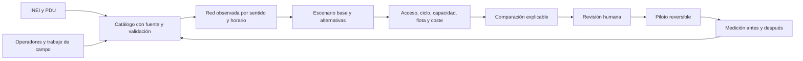

# Dossier maestro para la postulación a la Ideatón por el Transporte Urbano de Juliaca

## Desafío 2 - Innovación Tecnológica para la Movilidad Urbana Sostenible e Inseguridad

**Propuesta recomendada:** **Juliaca se mueve: rutas y frecuencias con evidencia**  
**Subtítulo:** Plataforma para comparar mejoras de transporte antes de llevarlas a la calle.  
**Versión de trabajo:** 1.0, 20 de septiembre de 2026.  
**Estado:** documento maestro para análisis, revisión y posterior diseño en PDF. No es todavía el PDF final de postulación.

---

## 0. Cómo usar este documento

Este archivo reúne en un solo lugar:

1. La lectura operativa de las bases del concurso.
2. La decisión de postular al Desafío 2 y su justificación.
3. El diagnóstico del problema y la propuesta de valor.
4. Lo que el prototipo ya hace y lo que todavía no hace.
5. La estructura sugerida, página por página, del PDF de postulación.
6. El método técnico, el piloto, los indicadores, el presupuesto y los riesgos.
7. La estrategia para responder a los cinco criterios del jurado.
8. El guion de cinco minutos y las preguntas previsibles.
9. Las listas de información y documentos que aún deben completarse.

### Regla editorial

Antes de convertir este documento en PDF:

- Sustituir todos los campos marcados como **[COMPLETAR]**.
- Eliminar todas las notas marcadas como **[NOTA INTERNA]**.
- Mantener visibles las advertencias necesarias para no confundir datos documentales, supuestos y resultados medidos.
- No afirmar que una función futura ya está implementada.
- No presentar una cifra estimada como si fuera una medición real.

### Leyenda de evidencia

| Etiqueta | Significado | Uso en el PDF |
|---|---|---|
| **[BASES]** | Requisito confirmado en las bases de 9 páginas | Debe cumplirse sin excepción |
| **[IMPLEMENTADO]** | Función existente en el prototipo y respaldada por código/pruebas | Puede demostrarse en vivo o mediante capturas |
| **[DOCUMENTAL]** | Información encontrada en el PDU, PMUS anunciado u otra fuente | Citar fuente, página, fecha y limitaciones |
| **[SUPUESTO]** | Parámetro utilizado para explorar un escenario | Debe mostrarse como configurable, no como verdad local |
| **[META]** | Resultado que el piloto intentará alcanzar | No presentarlo como beneficio ya obtenido |
| **[PENDIENTE]** | Dato, validación, alianza o desarrollo aún no disponible | Explicar cómo y cuándo se resolverá |

---

# PARTE I. LECTURA ESTRATÉGICA DE LAS BASES

## 1. Decisión de categoría

### Categoría recomendada

**Desafío 2: Innovación Tecnológica para la Movilidad Urbana Sostenible e Inseguridad.**

Pregunta del desafío: cómo usar la tecnología para lograr una movilidad urbana más eficiente, segura y sostenible en Juliaca.

### Por qué el proyecto encaja mejor en el Desafío 2

El producto central no es una obra vial ni una reestructuración impuesta de rutas. Es una plataforma tecnológica que:

- integra datos de población, recorridos, puntos de abordaje, destinos, calendario y flota;
- compara un servicio base con alternativas de frecuencia, abordaje o recorrido;
- calcula consecuencias operativas con la misma flota disponible;
- muestra sectores beneficiados, sectores perjudicados y datos faltantes;
- conserva la fuente y las limitaciones de cada dato;
- permite revisar una alternativa antes de proponer un ensayo en calle.

La reestructuración de rutas, tema del Desafío 1, es una posible aplicación de la herramienta. No debe convertirse en la identidad principal de la postulación, porque las bases obligan a elegir un solo desafío.

### Cómo incorporar seguridad sin desviar la propuesta

La propuesta abordará seguridad desde elementos que pueden medirse y revisarse:

- ubicación y condición de puntos de abordaje;
- acceso peatonal, cruces, barreras y veredas;
- capacidad y sobrecarga de las unidades;
- restricciones y afectaciones de las calles;
- trazabilidad y validación antes de publicar cambios a pasajeros;
- reportes agregados y revisados, sin exponer domicilios o trayectorias personales.

No se propondrá predecir delitos, clasificar barrios como peligrosos ni afirmar que la ausencia de reportes equivale a seguridad.

## 2. Requisitos obligatorios y control de elegibilidad

| Requisito | Interpretación operativa | Estado |
|---|---|---|
| Edad | Cada integrante debe tener de 15 a 29 años cumplidos al cierre | **[COMPLETAR]** |
| Equipo | Preparar exactamente 3 integrantes | **[COMPLETAR]** |
| Un solo equipo | Cada integrante participa en un único equipo | **[COMPLETAR]** |
| Nombre del equipo | No usar marcas registradas ni expresiones prohibidas | **[COMPLETAR]** |
| Líder | Designar a una persona representante | **[COMPLETAR]** |
| Anexo 01 | Ficha con propuesta, desafío, equipo, líder, contacto, DNI, edad y rol | **[COMPLETAR]** |
| Anexo 02 | Uno por cada integrante menor de 18 años, firmado por padre, madre o apoderado | **[COMPLETAR / NO APLICA]** |
| Propuesta | Cargar PDF o PPT según el campo indicado en el formulario | **[COMPLETAR]** |
| Plazo | 20 de septiembre de 2026 hasta las 23:59 | **URGENTE** |
| Formulario | Enlace oficial incluido en las bases | **[COMPLETAR ENVÍO]** |
| Presencial | Si el equipo es habilitado: 25 de septiembre de 2026 desde las 08:00 | **[CONFIRMAR DISPONIBILIDAD]** |
| Pitch | Máximo 5 minutos, con apoyo PDF o PPT, seguido de preguntas | **[PREPARAR]** |

### Aclaración sobre el número de integrantes

La sección 5.2 menciona “3 personas máximo”, pero la sección VI exige que el equipo esté conformado por tres integrantes. La opción que satisface ambas redacciones es presentar **exactamente tres personas**.

### Otros efectos de la inscripción

- Los integrantes no pueden modificarse después de presentar la propuesta.
- La propuesta debe ser original y no vulnerar derechos de terceros.
- La inscripción implica aceptar las bases.
- Los participantes autorizan el uso de su imagen, voz y propuesta para difusión del evento.
- Las decisiones de validación y del jurado son definitivas.

## 3. Fechas y puntos que conviene confirmar con la organización

Contacto oficial incluido en las bases: `ideaton.transporte.juliaca2026@gmail.com`.

Preguntas recomendadas, solo si todavía hay tiempo y no retrasan el envío:

1. ¿Cuál es el tamaño máximo del archivo de propuesta?
2. ¿Existe un límite de páginas o diapositivas?
3. ¿El Anexo 01 debe adjuntarse dentro del mismo PDF o en un archivo separado?
4. ¿La firma del Anexo 01 corresponde al líder o a los tres integrantes?
5. ¿Se permiten enlaces o códigos QR hacia una demostración?
6. ¿La hora “12:00 a. m.” del cronograma significa 12:00 del mediodía?
7. ¿Cuál es la dirección exacta de la fase presencial?

El formulario enlazado por las bases exige inicio de sesión con Google. En esta revisión no se accedió a ninguna cuenta ni se inspeccionaron campos privados del formulario. Por ello, el límite de archivo y cualquier campo adicional deben verificarse al momento de la carga.

## 4. Cómo evalúa el jurado

Cada criterio vale 20% y se califica de 1 a 5. En caso de empate se prioriza Impacto y luego Innovación.

| Criterio | Qué espera el jurado | Respuesta de esta propuesta |
|---|---|---|
| Innovación | Originalidad y diferenciación | Comparación explicable con datos locales, flota, calendario, trazabilidad y zonas que ganan o pierden acceso |
| Impacto | Alcance y beneficio potencial | Indicadores antes/después, metas del piloto, población conocida cubierta y servicios alcanzables |
| Viabilidad | Factibilidad técnica, operativa y económica | Prototipo existente, piloto acotado, cronograma, presupuesto y datos faltantes identificados |
| Claridad | Coherencia entre problema, solución y plan | Una pregunta central, un flujo de demostración y un plan por etapas |
| Trabajo en equipo y exposición | Dominio, claridad y respuesta | Tres roles, participación de los tres miembros, pitch cronometrado y banco de preguntas |

### Consecuencia estratégica

La presentación no debe intentar impresionar solo con tecnología. Debe demostrar, en este orden:

1. qué problema concreto se decide;
2. qué evidencia se usa;
3. qué alternativas se comparan;
4. qué mejora y qué empeora;
5. qué recursos se necesitan;
6. cómo se comprobará en un piloto.

---

# PARTE II. IDENTIDAD Y MENSAJE CENTRAL

## 5. Nombre, frase y resumen

### Nombre recomendado de la propuesta

**Juliaca se mueve: rutas y frecuencias con evidencia**

Alternativas si el equipo prefiere otro tono:

- **Juliaca se mueve: rutas que conectan barrios y oportunidades**
- **Juliaca se mueve: decisiones inteligentes para el transporte urbano**
- **Juliaca se mueve: laboratorio de movilidad urbana**

Usar un solo nombre en el formulario, el Anexo 01, el PDF y el pitch.

### Frase de valor

> Transformamos población, recorridos, destinos y condiciones de operación en alternativas de transporte que pueden compararse antes de llevarlas a la calle.

### Mensaje de 20 segundos

> En Juliaca, cambiar una ruta o aumentar su frecuencia puede ayudar a un barrio y perjudicar a otro si no se considera la flota, el tiempo de ciclo, las ferias y el acceso real a los destinos. Juliaca se mueve es una plataforma que compara esas decisiones con datos locales, explica sus consecuencias y prepara un piloto medible junto con operadores y usuarios.

### Resumen ejecutivo listo para adaptar

**Juliaca se mueve** es una plataforma de apoyo a decisiones para mejorar rutas, puntos de abordaje y frecuencias del transporte urbano. Integra población por manzana, recorridos por sentido, destinos, horarios, flota y afectaciones de las calles. A partir de una línea base, compara alternativas y muestra cobertura, acceso a oportunidades, tiempo estimado, intervalo sostenible, unidades necesarias, coste y sectores que podrían mejorar o empeorar.

La propuesta responde al Desafío 2 porque utiliza tecnología para hacer más transparente, verificable y sostenible la planificación del transporte. El prototipo ya incluye un laboratorio de movilidad, un catálogo documental del PDU, edición de recorridos y comparación de escenarios. Todavía requiere recorridos oficiales u observados, frecuencias reales, demanda origen-destino y validación de campo antes de recomendar cambios operativos.

El primer piloto se plantea sobre un corredor y dos o tres líneas, comparando el servicio observado con mejoras de frecuencia, puntos de abordaje y una modificación limitada del recorrido. Los resultados se medirán con los mismos indicadores y la misma flota activa. La plataforma no sustituye la decisión de la autoridad ni del operador: prepara evidencia para una revisión conjunta y un ensayo reversible.

## 6. Problema central

### Formulación recomendada

> Las decisiones sobre recorridos, paraderos y frecuencias en Juliaca necesitan integrar información que hoy está dispersa o incompleta. Sin una comparación común, una modificación puede ampliar la cobertura pero aumentar la espera, requerir más vehículos, perder una conexión o trasladar el problema hacia otro sector.

### Evidencia local disponible

El diagnóstico PDU revisado aporta un punto de partida documental:

- 40 registros de líneas y composición de flota en las páginas 177-178;
- longitudes por sentido y diferencias entre itinerarios documentados y operación descrita en las páginas 179-180;
- tramos congestionados en distintas franjas entre las páginas 181-182;
- mercados, comercios, hospitales y otros atractores en las páginas 184-185;
- terminales, destinos y horarios interurbanos en la página 188;
- ocupación vial permanente, semanal y por festividades en las páginas 191-195.

La propia fuente contiene inconsistencias que justifican la trazabilidad del proyecto. Por ejemplo, imprime 1.963 vehículos, mientras la suma de las 40 filas revisadas produce 1.969: 1.814 combis y 155 microbuses. Otra sección cita 42 rutas y 1.970 vehículos en el contexto de informes de 2023. Estos valores no deben mezclarse ni presentarse como padrón vigente.

### Qué no puede concluirse todavía

Los documentos disponibles no permiten afirmar por sí solos:

- cuántas unidades operan en cada franja;
- la frecuencia real de cada línea;
- cuántos pasajeros viajan entre cada origen y destino;
- qué recorrido exacto y vigente realiza cada servicio;
- cuánto se reduciría la congestión con una alternativa;
- cuál es la ruta óptima de toda la ciudad.

La propuesta convierte esos vacíos en un plan de medición y validación, en lugar de ocultarlos.

## 7. Pregunta central del proyecto

> ¿Qué cambio pequeño en recorridos, puntos de abordaje o frecuencia puede mejorar el acceso a trabajo, educación, salud y comercio con la flota realmente disponible, sin ocultar quién pierde acceso ni cuánto cuesta operar el cambio?

## 8. Objetivos

### Objetivo general

Desarrollar y validar una plataforma tecnológica que compare alternativas de transporte urbano en Juliaca mediante datos locales, restricciones operativas e indicadores de acceso, para apoyar decisiones transparentes y pilotos medibles.

### Objetivos específicos

1. Organizar población, rutas, destinos, calendarios y flota con fuente, fecha y estado de validación.
2. Representar ida, vuelta, puntos de abordaje y condiciones de operación sin confundir datos documentales con servicios vigentes.
3. Comparar un escenario base con alternativas de frecuencia, abordaje o recorrido usando los mismos supuestos.
4. Mostrar unidades necesarias, capacidad, costes, cobertura y sectores beneficiados o perjudicados.
5. Diseñar un piloto acotado que permita medir resultados antes y después.
6. Proteger la información personal y publicar solo servicios revisados y autorizados.

## 9. Beneficiarios y usuarios

| Usuario | Necesidad | Valor ofrecido |
|---|---|---|
| Pasajeros | Menos incertidumbre y mejor acceso a destinos | Opciones comprensibles y servicios publicados solo después de validación |
| Barrios periféricos o con datos incompletos | No quedar invisibles en la planificación | Cobertura de datos visible y análisis de sectores excluidos |
| Operadores | Probar cambios sin comprometer toda la operación | Cálculo de ciclo, frecuencia, flota y costes por escenario |
| Municipalidad y equipos técnicos | Decidir con evidencia trazable | Comparación reproducible, fuentes y restricciones explícitas |
| Investigadores y equipo de campo | Recoger datos que respondan decisiones concretas | Formularios de observación y catálogo de pendientes |

No presentar a estos grupos como aliados confirmados mientras no exista un acuerdo formal.

---

# PARTE III. SOLUCIÓN Y ESTADO REAL DEL PRODUCTO

## 10. Propuesta de solución

La plataforma sigue un ciclo de seis pasos:

1. **Ver la evidencia:** población, destinos, rutas documentadas, conflictos y datos faltantes.
2. **Definir la línea base:** recorrido observado, abordajes, horario, intervalo, flota activa y costes.
3. **Crear una alternativa:** cambiar frecuencia, puntos de abordaje o un tramo limitado del recorrido.
4. **Calcular consecuencias:** cobertura, tiempo, flota, capacidad, coste y zonas que ganan o pierden acceso.
5. **Revisar con personas:** operador, usuarios, equipo técnico y trabajo de campo.
6. **Ensayar y medir:** piloto reversible, comparación antes/después y decisión de continuar o corregir.

### Diferenciación principal

El valor no consiste solo en mostrar rutas sobre un mapa. La diferenciación es:

- comparar alternativas con la misma base de evaluación;
- explicar por qué una alternativa aparece como factible o inviable;
- tratar por separado un día normal, una franja punta o un día de feria;
- calcular si la flota sostiene la frecuencia propuesta;
- mantener visibles las zonas que pierden acceso;
- conservar fuentes, fechas, supuestos y discrepancias;
- separar las propuestas de la información pública para pasajeros.

## 11. Estado del prototipo al 20 de septiembre de 2026

### Funciones implementadas y verificables

| Componente | Estado comprobado |
|---|---|
| Mapa y planificación | Interfaz React/TypeScript, MapLibre, rutas sintéticas, ida/vuelta, lugares y opciones de viaje |
| Editor de recorridos | Dibujo por sentido, ajuste a calles, borradores, revisión, importación/exportación y publicación local separada |
| Datos censales | Lectura de 6.929 manzanas de Juliaca y San Miguel; 246.911 habitantes asociados al Censo 2017; 3.728 manzanas sin población asociada |
| Catálogo PDU | 40 registros de líneas/flota, 17 atractores, 5 calendarios y 23 evidencias con páginas y límites |
| Destinos | Entradas, categoría, grupo, días, horarios, fuente y validación; evita multiplicar oportunidades del mismo complejo |
| Comparador | Línea base y alternativa; ambos sentidos; ciclo, intervalo, flota activa/reserva, capacidad, costes y acceso |
| Calendario | Minutos adicionales o suspensión por línea, día y ventana; los pendientes no se aplican como hechos |
| Acceso | Proximidad exploratoria y posibilidad de importar conexiones peatonales verificadas |
| Alternativas | Evaluación de intervalos y generación de desvíos acotados en ida y vuelta |
| Campo | Registro de conteos agregados, ciclos e intervalos antes/después |
| Trazabilidad | Estudios con entradas, versión del motor, resultados y exportación reproducible |
| Persistencia | Navegador en modo local y API protegida para SQLite/PostgreSQL cuando se conecta |

### Verificación ejecutada para este dossier

- **46 pruebas de API aprobadas.**
- **86 pruebas de lógica web aprobadas.**
- **TypeScript sin errores.**

Estas pruebas comprueban comportamiento de software. No certifican que los recorridos sintéticos correspondan a servicios reales ni sustituyen viajes observados en campo.

### Funciones que no deben presentarse como implementadas

| Pendiente | Qué hace falta |
|---|---|
| Optimización conjunta de toda la red | Formulación, demanda calibrada, candidatos y OR-Tools |
| Demanda origen-destino real | Encuestas, ascensos/descensos, conteos y metodología de expansión |
| Rutas oficiales o vigentes | Geometrías por sentido, resoluciones, variantes y revisión con operadores/autoridad |
| Frecuencias y flota activa | Observación por franja o datos del operador |
| Planificación multimodal real con OTP | GTFS validado, red OSM revisada, grafo y servidor probado |
| Simulación de congestión | Aforos, semáforos, colas, calibración y eventualmente SUMO |
| ETA o GPS real | Proveedor, permiso, API, históricos y evaluación del error |
| Despliegue productivo | API, PostGIS, OTP, HTTPS, copias, monitoreo y presupuesto |
| Impacto medido | Piloto autorizado y medición antes/después |

### Forma correcta de describir el estado

> Ya construimos un prototipo funcional que organiza evidencia y compara una línea base con una alternativa. Ahora proponemos validarlo sobre dos o tres líneas reales mediante datos operativos y trabajo de campo.

### Frases que deben evitarse

- “Ya optimizamos todas las rutas de Juliaca”.
- “La aplicación reduce la congestión en X%”.
- “Tenemos GPS en tiempo real”.
- “Estas son rutas oficiales”.
- “La población sin dato es cero”.
- “El algoritmo decide automáticamente qué ruta debe aprobarse”.
- “La inteligencia artificial predice la inseguridad”.

## 12. Arquitectura: presente y evolución

### Arquitectura actual

| Capa | Tecnología | Función actual |
|---|---|---|
| Interfaz | React, TypeScript, MapLibre/Leaflet | Mapas, edición, pasajeros, administración y laboratorio |
| Cálculo web | TypeScript y Web Worker | Acceso, flota, calendario y comparación sin bloquear la interfaz |
| API | FastAPI/Python | Red, publicaciones, observaciones, GPS normalizado y estado del laboratorio |
| Persistencia | SQLite local; configuración PostgreSQL/PostGIS | Desarrollo local y ruta de migración a instalación espacial |
| Interoperabilidad | GeoJSON, JSON, GTFS de demostración, adaptador OTP | Exportación e integración futura, con límites documentados |

### Arquitectura objetivo del piloto

### Tecnologías futuras y su función real

| Herramienta | Uso propuesto | No debe afirmarse |
|---|---|---|
| PostgreSQL/PostGIS | Almacenar y cruzar datos espaciales con versiones | Que por sí solo corrige datos inconsistentes |
| OR-Tools | Seleccionar combinaciones factibles de frecuencia/candidatos | Que diseña automáticamente la mejor red de toda la ciudad |
| OpenTripPlanner | Evaluar itinerarios sobre GTFS y OSM | Que crea nuevas líneas sin un modelo adicional |
| SUMO | Simular un corredor después de calibrarlo | Que una animación visual actual ya simula congestión |

---

# PARTE IV. DATOS, MÉTODO Y ESCENARIOS

## 13. Fuentes de datos y reglas de calidad

### Datos disponibles

| Fuente | Aporte | Restricción |
|---|---|---|
| Bases del concurso | Desafíos, requisitos, fechas y rúbrica | No define límite de páginas o tamaño del archivo |
| PDU Juliaca 2026-2035, diagnóstico | Líneas, flota, atractores, calles, terminales y afectaciones | Contiene fechas y cifras que deben conciliarse |
| Censo 2017 por manzana | Distribución residencial histórica | No representa automáticamente población 2026 ni demanda de viajes |
| Proyecto actual | Red sintética, editor, laboratorio y API | Es demostración, no servicio oficial |
| Anuncio PMUS | Contexto de movilidad metropolitana | No sustituye la matriz OD ni el informe técnico |

### Datos que el piloto debe conseguir

1. Recorrido observado de ida y vuelta.
2. Puntos de abordaje y bajada por sentido.
3. Primera y última salida, intervalos y regularidad por franja.
4. Flota activa, reserva, capacidad habilitada y tipo de vehículo.
5. Tiempo de ciclo, regulación y principales demoras.
6. Carga por tramo y personas que no pueden abordar.
7. Entradas y horarios reales de 10 a 20 destinos.
8. Calles afectadas y ventanas horarias en días de feria.
9. Costes por kilómetro y por hora, evitando duplicarlos.
10. Muestra agregada de origen, destino, motivo, transbordos y coste.

### Reglas de calidad

- Un dato nulo no se convierte en cero.
- Una fuente documental no se presenta como observación actual.
- Ida y vuelta se modelan por separado.
- Un vértice del dibujo no se convierte automáticamente en paradero.
- Una empresa, una línea, una variante y un vehículo son entidades distintas.
- Un complejo comercial con varias entradas no multiplica visitantes.
- Una afectación de feria modifica tanto circulación como demanda, si ambas están sustentadas.
- Los datos personales no se publican; se trabaja con conteos y viajes agregados.

## 14. Método de análisis

### Nivel 1: accesibilidad potencial

Se puede ejecutar con población conocida, abordajes y destinos. Responde qué sectores están próximos o conectados a servicios bajo parámetros explícitos. No pronostica pasajeros.

### Nivel 2: operación observada

Incorpora tiempo de ciclo, intervalos, flota activa, capacidad, coste y calendario. Permite comparar el mismo recorrido con otros despachos o puntos de abordaje.

### Nivel 3: demanda calibrada

Utiliza viajes origen-destino agregados, ascensos/descensos y carga por tramo. Permite evaluar saturación, viajes no atendidos y distribución entre alternativas.

### Nivel 4: optimización y tráfico

Selecciona combinaciones de alternativas bajo restricciones. El impacto sobre tráfico requiere aforos, intersecciones y calibración. Es una fase posterior, no el resultado actual.

## 15. Cálculos principales

### Ciclo e intervalo sostenible

`tiempo de ciclo = tiempo de ida + tiempo de vuelta + regulación + demoras del escenario`

`unidades necesarias = redondear hacia arriba(tiempo de ciclo / intervalo solicitado)`

Si la flota disponible no alcanza, la plataforma debe aumentar el intervalo sostenible o marcar la alternativa como inviable. No debe inventar unidades.

### Oferta por hora

`plazas por hora y sentido = 60 / intervalo sostenible × capacidad habilitada`

La capacidad se revisa en el tramo y sentido de mayor carga. No se divide la demanda diaria entre toda la flota.

### Tiempo completo de viaje

`tiempo completo = caminata inicial + espera + viaje en vehículo + transbordos + caminata final`

La espera equivalente a medio intervalo es solo una aproximación cuando el servicio es regular. Debe sustituirse o complementarse con intervalos observados.

### Coste operativo

`coste por hora = vehículo-km por hora × coste por km + unidades en servicio × coste por unidad-hora`

Los dos parámetros deben revisarse para no contar dos veces combustible, mantenimiento o personal.

## 16. Escenarios mínimos

| Código | Escenario | Pregunta que responde |
|---|---|---|
| S0 | Operación observada actual | ¿Cuál es la línea base medible? |
| S1 | Mismo recorrido, mejor despacho/frecuencia | ¿Puede reducirse espera sin cambiar cobertura? |
| S2 | Ajuste de puntos de abordaje y acceso | ¿Puede reducirse caminata o conflicto de detención? |
| S3 | Modificación limitada con igual flota | ¿La ganancia de cobertura compensa el mayor ciclo? |
| S4 | Variante planificada para día de feria | ¿Cómo mantener el acceso con calles y demanda distintas? |
| S5 | Interrupción por lluvia u obra | ¿Qué conexiones se pierden y cuál es la contingencia? |

Para el concurso, mostrar S0, S1 y una alternativa S2 o S3. S4 puede ser el diferenciador local si la ventana y el tramo han sido verificados. S5 debe quedar como ampliación.

## 17. Indicadores

| Indicador | Medición | Advertencia |
|---|---|---|
| Acceso a abordajes | Habitantes conocidos únicos con conexión en umbral 300/400/500 m | No equivale a demanda |
| Acceso a oportunidades | Personas que alcanzan un servicio abierto dentro de un umbral temporal | Cercanía no garantiza cupo o atención |
| Tiempo completo | Mediana y percentil 90 de caminata, espera, vehículo y transbordo | Aclarar ponderación y viajes desconectados |
| Regularidad | Distribución de intervalos y agrupamiento | No sustituir por frecuencia nominal |
| Carga | Pasajeros por tramo, hora y sentido frente a capacidad | El promedio diario puede ocultar sobrecarga |
| Flota | Unidades activas, reserva y unidades necesarias | Padrón afiliado no equivale a flota operativa |
| Coste | Horas-vehículo, vehículo-km y coste | Requiere datos del operador |
| Equidad | Sectores que mejoran, quedan igual o empeoran | Mantener visibles zonas sin datos |
| Sostenibilidad | Vehículo-km, consumo o emisiones con metodología | No afirmar CO2 sin datos de flota y factores |

### Meta principal propuesta para el piloto

**[META]** Reducir al menos 10% el tiempo completo de los viajes evaluados, manteniendo la misma flota activa, sin perder conexiones esenciales ni superar la capacidad definida.

Esta es una meta para decidir si el piloto continúa. No es un resultado ya obtenido. Si la línea base aún no permite medir tiempo completo, sustituirla por una meta de accesibilidad verificable.

---

# PARTE V. PILOTO, VIABILIDAD Y SOSTENIBILIDAD

## 18. Alcance del piloto recomendado

### Alcance

- un corredor o área de estudio;
- dos o tres líneas;
- diez a veinte destinos;
- ida y vuelta;
- tres franjas del día;
- al menos un día ordinario y un día comercial relevante;
- comparación S0-S3;
- ensayo operativo solo si existe aprobación.

### Área candidata

Acceso al centro y entorno de Jáuregui, Unión, San Román y Mariano Núñez, debido a los desvíos y conflictos documentados. Líneas como Las Mercedes L-01, 1ro de Mayo L-04 o Sur Horizonte L-18 son candidatas para conversar, no selecciones definitivas.

### Criterios para elegir definitivamente

1. Operador dispuesto a colaborar.
2. Recorrido y servicio verificables.
3. Problema observable y medible.
4. Posibilidad de comparar días y franjas semejantes.
5. Restricciones viales manejables.
6. Beneficio potencial para sectores con acceso insuficiente.
7. Capacidad de revertir el ensayo si el resultado es negativo.

## 19. Trabajo de campo

### Diseño inicial

Observar dos días hábiles ordinarios y un día comercial relevante, en ventanas de mañana, mediodía y tarde. Ajustar la duración después del reconocimiento.

### Datos por sentido

- hora de paso de unidades;
- tipo y capacidad;
- ascensos y descensos agregados;
- ocupación por tramo;
- tiempo de viaje y tiempo de espera;
- intervalos entre unidades;
- demora y causa;
- condición de abordajes, cruces y acceso peatonal;
- clima, obras, feria u otra condición del día.

### Privacidad

No recoger nombres, DNI ni domicilio exacto. Las encuestas deben usar zonas de origen/destino y resultados agregados.

### Validación

Reservar observaciones o viajes que no se utilicen para ajustar parámetros. No calibrar y evaluar con exactamente los mismos registros.

## 20. Cronograma posterior a la ideatón

| Fase | Duración orientativa | Entrega |
|---|---:|---|
| 0. Acuerdo de alcance | 2-3 días | Área, operador, responsabilidades y datos disponibles |
| 1. Inventario y conciliación | Semana 1 | Catálogo, geometrías candidatas y reglas de calidad |
| 2. Reconocimiento y campo | Semanas 1-2 | Línea base observada por sentido y franja |
| 3. Comparación inicial | Semanas 2-3 | S0-S2, acceso, flota y costes |
| 4. Alternativas y calibración | Semanas 3-5 | S3-S4 y validación independiente |
| 5. Revisión y ensayo | Semanas 5-7 | Piloto condicionado a autorización y mecanismo de reversión |
| 6. Evaluación | Semana 8 | Informe antes/después y decisión de ampliar, corregir o detener |

### Esfuerzo orientativo

| Actividad | Horas-persona |
|---|---:|
| Datos y GIS | 40-60 |
| Coordinación y campo | 48-72 |
| Backend y modelo | 64-96 |
| Interfaz y comparación | 32-48 |
| QA, documentación y presentación | 24-40 |
| **Total orientativo** | **208-316** |

## 21. Presupuesto preliminar

Este presupuesto es una referencia para demostrar viabilidad. Debe reemplazarse con tarifas, aportes y cotizaciones reales antes de presentarlo como definitivo.

| Concepto | Supuesto ilustrativo | Importe |
|---|---:|---:|
| Trabajo del equipo | 240 h-persona × S/30 | S/7.200 |
| Movilidad, datos y materiales de campo | Bolsa inicial | S/900 |
| Infraestructura del piloto | Servidor, almacenamiento y pruebas | S/300 |
| Revisión técnica | Acompañamiento especializado | S/800 |
| Subtotal |  | S/9.200 |
| Contingencia | 15% | S/1.380 |
| **Total ilustrativo** |  | **S/10.580** |

Separar siempre:

- desembolso en efectivo;
- trabajo aportado y valorizado;
- servicios donados o institucionales;
- costes recurrentes después del piloto.

Que una herramienta sea de código abierto no significa que la operación, el servidor, los datos y el mantenimiento sean gratuitos.

## 22. Sostenibilidad y adopción

Modelo propuesto de responsabilidades:

| Actor propuesto | Responsabilidad |
|---|---|
| Equipo del proyecto | Software, calidad, documentación y soporte inicial |
| Operadores | Recorridos observados, flota activa, despachos y revisión operativa |
| Municipalidad/equipo técnico | Validación, planificación y eventual autorización |
| Instituciones y destinos | Entradas, horarios y actividad agregada |
| Usuarios y trabajo de campo | Experiencia, tiempos y barreras, con privacidad |

Estas son funciones deseadas, no convenios confirmados. La sostenibilidad debe apoyarse en documentación, formatos exportables y transferencia de conocimiento para evitar dependencia del equipo original.

## 23. Riesgos y respuesta

| Riesgo | Respuesta de control |
|---|---|
| Cifras incompatibles entre fuentes | Conservar originales, fecha y conflicto; solicitar padrón vigente |
| Manzanas sin población asociada | Mostrar cobertura de datos y priorizar verificación; nunca usar cero automático |
| Destinos sin afluencia | Usarlos para organizar campo, no inventar pasajeros |
| Geometría imprecisa | Verificar ambos sentidos y conservar versión documentada, observada y propuesta |
| Falta de operador | Cambiar el piloto o mantenerlo como análisis potencial sin prometer ensayo |
| Más cobertura pero peor frecuencia | Calcular tiempo de ciclo e intervalo con la misma flota |
| Mejora del centro y perjuicio periférico | Mostrar ganadores, perdedores y conexiones esenciales |
| Mayor coste o transbordo | Incluir tarifa, espera y coste en la comparación |
| Feria, lluvia u obra | Registrar tipo de día y ventanas; no atribuir todo al cambio de ruta |
| Falta de datos de tráfico o emisiones | Posponer afirmaciones y mantener indicadores operativos |
| Publicación prematura | Separar propuestas, borradores y servicios validados |

---

# PARTE VI. ESTRUCTURA DEL PDF DE POSTULACIÓN

## 24. Formato recomendado

Como las bases no establecen un límite de páginas, se recomienda preparar un PDF A4 de **10 páginas principales**, más **2 a 4 páginas de anexos**. Si el formulario impone otro límite, conservar las páginas 1-10 y mover los detalles técnicos a un enlace o anexo separado autorizado.

El PDF debe poder comprenderse sin abrir la aplicación. La demostración y las capturas son evidencia adicional, no sustitutos del argumento.

### Criterios de diseño

- Una idea principal por página.
- Títulos que expresen una conclusión, no solo un tema.
- Máximo dos colores de énfasis, además de la paleta cartográfica.
- Mapas con leyenda, fuente, fecha y estado de validación.
- Capturas sin datos personales ni claves.
- Diferenciar visualmente “actual”, “alternativa” y “pendiente”.
- Usar tablas cortas y cifras grandes solo cuando estén sustentadas.
- Incluir número de página y nombre de la propuesta.

## 25. Página 1 - Portada

### Contenido

- Logo o símbolo propio **[COMPLETAR]**.
- Nombre: **Juliaca se mueve: rutas y frecuencias con evidencia**.
- Subtítulo: Plataforma para comparar mejoras de transporte antes de llevarlas a la calle.
- Desafío 2 completo.
- Nombre del equipo **[COMPLETAR]**.
- Integrantes **[COMPLETAR]**.
- Juliaca, septiembre de 2026.

### Mensaje visual

Mapa simplificado con una ruta base y una alternativa; no usar una geometría sintética sin rotularla como demostración.

## 26. Página 2 - El problema que queremos resolver

### Título sugerido

**Cambiar una ruta sin medir todo el viaje puede trasladar el problema en vez de resolverlo.**

### Contenido

- Información dispersa sobre población, rutas, frecuencia, flota, destinos y calles.
- Diferencias entre itinerario documentado, recorrido observado y propuesta.
- Ferias y afectaciones que cambian circulación y demanda según el día.
- Consecuencia: no es suficiente dibujar una línea más corta o cubrir más barrios.

### Evidencia visual

Una composición con:

- mapa o recorte del área candidata;
- tres datos documentales del PDU con página;
- una caja de “qué todavía no sabemos”.

### Texto breve sugerido

> Una mejora de transporte debe considerar el viaje completo y los recursos disponibles. Una extensión puede acercar el servicio a un barrio, pero también alargar el ciclo, aumentar la espera o requerir más unidades. Hoy esa comparación necesita integrar fuentes y mediciones que están separadas.

## 27. Página 3 - Nuestra respuesta

### Título sugerido

**Una plataforma que compara decisiones antes de probarlas en la calle.**

### Contenido

Mostrar el flujo:

`evidencia → línea base → alternativa → cálculo → revisión → piloto`

Incluir las cuatro preguntas que responde:

1. ¿Qué mejora?
2. ¿Para quién mejora o empeora?
3. ¿Cuántas unidades y cuánto coste requiere?
4. ¿Qué dato o supuesto sostiene la recomendación?

### Visual

Diagrama de seis pasos y una captura limpia del comparador.

## 28. Página 4 - Cómo funciona

### Título sugerido

**Población, destinos, operación y calendario se evalúan con la misma base.**

### Cuatro bloques

1. **Datos y calidad:** población conocida, vacíos, fuentes y conflictos.
2. **Oferta:** ida/vuelta, abordajes, flota, capacidad, intervalo y coste.
3. **Actividad urbana:** trabajo, educación, salud, comercio y tipo de día.
4. **Comparación:** cobertura, tiempo, acceso, recursos y equidad.

### Nota clave

> El censo indica dónde viven personas; no indica por sí solo cuántos viajes realizan ni hacia dónde. La demanda se calibra después con observación y encuestas agregadas.

## 29. Página 5 - Qué ya construimos

### Título sugerido

**La idea ya tiene un prototipo funcional y comprobable.**

### Mostrar

- laboratorio de movilidad;
- editor de recorridos por sentido;
- catálogo PDU y calidad;
- destinos/calendario;
- comparación de flota, acceso y costes;
- exportación y guardado de estudios.

### Evidencia técnica

`46 pruebas API + 86 pruebas web + TypeScript correcto`

### Advertencia visible

> Las rutas de demostración no son servicios oficiales. El prototipo prepara y compara escenarios; el piloto validará datos reales.

## 30. Página 6 - La demostración principal

### Título sugerido

**Con la misma flota, una mayor cobertura puede aumentar la espera.**

### Escenario de demostración

Comparar:

- S0: recorrido base y frecuencia observada o supuesta claramente rotulada;
- S1: mismo recorrido con otro intervalo;
- S3: desvío limitado con igual flota.

### Indicadores mínimos

- tiempo de ciclo;
- intervalo solicitado y sostenible;
- unidades necesarias;
- plazas por hora;
- población conocida con acceso;
- destinos alcanzables;
- sectores que ganan y pierden;
- coste/hora si los parámetros están disponibles.

### Importante

Si al cierre solo existen datos sintéticos, titular el caso como **“demostración del método”**, no como resultado de Juliaca.

## 31. Página 7 - Innovación e impacto

### Título sugerido

**La innovación es hacer visible el efecto completo de cada decisión.**

### Innovación

- integra evidencia local y operación;
- compara tipo de día y horario;
- protege la flota como restricción real;
- explica factibilidad e incertidumbre;
- identifica ganadores y perdedores;
- conserva trazabilidad y revisión humana.

### Impacto esperado

- mejor acceso a oportunidades;
- menor tiempo completo o mayor regularidad;
- decisiones reversibles antes de escalar;
- mejor uso de unidades existentes;
- priorización de datos faltantes y sectores invisibles.

### Meta

Incluir la meta principal del piloto como **objetivo**, no resultado.

## 32. Página 8 - Piloto y validación

### Título sugerido

**Empezamos pequeño para medir bien y escalar con evidencia.**

### Contenido

- un corredor;
- dos o tres líneas;
- diez a veinte destinos;
- días y franjas comparables;
- observación por sentido;
- revisión con operador y autoridad;
- ensayo reversible condicionado a autorización;
- informe antes/después.

### Visual

Cronograma de ocho semanas y criterios de continuar/corregir/detener.

## 33. Página 9 - Viabilidad técnica y económica

### Título sugerido

**El prototipo reduce el riesgo técnico; el piloto concentra recursos donde pueden medirse.**

### Contenido

- arquitectura actual y objetivo;
- tecnologías abiertas con costes operativos reconocidos;
- esfuerzo de 208-316 horas-persona;
- presupuesto preliminar o fórmula de presupuesto;
- datos y acuerdos que todavía faltan;
- responsables propuestos.

No dedicar la página a una lista de nombres tecnológicos. Conectar cada componente con una decisión.

## 34. Página 10 - Equipo, hoja de ruta y cierre

### Título sugerido

**Tres perfiles, una validación común y una ruta clara hacia el piloto.**

### Roles

- integrante 1: datos, GIS y evidencia;
- integrante 2: software, cálculo y demostración;
- integrante 3: operación, campo, coordinación y sostenibilidad.

Todos deben dominar el problema, la solución, los límites y los indicadores.

### Cierre sugerido

> Juliaca no necesita elegir entre más cobertura, menor espera y viabilidad operativa sin conocer sus consecuencias. Juliaca se mueve permite comparar esos compromisos, explicar cada resultado y comenzar con un piloto que pueda medirse, corregirse y escalarse con evidencia.

### Llamado a la acción

> Buscamos validar el piloto con operadores, usuarios y equipos técnicos para convertir datos dispersos en una decisión concreta y comprobable.

## 35. Anexos recomendados

### Anexo A - Matriz de fuentes

Fuente, página/tabla, fecha, dato utilizado, limitación y estado de validación.

### Anexo B - Matriz de indicadores

Fórmula, unidad, línea base, meta, fuente y frecuencia de medición.

### Anexo C - Capturas del prototipo

Capturas numeradas con una frase sobre qué decisión permite cada una.

### Anexo D - Riesgos y controles

Versión resumida de la tabla de riesgos de este documento.

### Anexo E - Enlaces

- demostración **[COMPLETAR]**;
- repositorio o paquete privado, si corresponde **[COMPLETAR]**;
- video breve, solo si está listo **[COMPLETAR / OMITIR]**.

No incluir claves, tokens, datos personales ni enlaces que dependan de un servidor local.

---

# PARTE VII. GUION DE PITCH Y PREPARACIÓN DEL EQUIPO

## 36. Guion exacto de cinco minutos

| Tiempo | Responsable | Contenido |
|---:|---|---|
| 0:00-0:40 | Integrante 1 | Problema concreto y por qué una ruta dibujada no basta |
| 0:40-1:25 | Integrante 1 | Evidencia local, vacíos y pregunta central |
| 1:25-2:50 | Integrante 2 | Demostración del flujo y comparación de escenarios |
| 2:50-3:50 | Integrante 2 | Indicadores, impacto esperado y diferencia del proyecto |
| 3:50-4:35 | Integrante 3 | Piloto, viabilidad, presupuesto y responsables |
| 4:35-5:00 | Integrante 3 | Cierre y solicitud de validación del piloto |

### Reglas de ensayo

- Ensayar a 4:40 para dejar margen.
- Preparar una versión de 3 minutos por si reducen el tiempo.
- No leer texto completo de la pantalla.
- Cada cifra debe tener fuente o etiqueta de supuesto/meta.
- Si la demostración falla, usar tres capturas consecutivas: base, alternativa y comparación.
- Cada integrante debe poder explicar el cálculo de flota y dos limitaciones del proyecto.

## 37. Preguntas probables y respuesta recomendada

### ¿Cómo saben cuántos pasajeros habrá?

> Hoy no lo afirmamos. El censo muestra demanda residencial potencial, no viajes. El piloto añadirá conteos, ascensos/descensos y encuestas agregadas para calibrar demanda por franja. Mientras tanto, el prototipo compara accesibilidad y recursos con escenarios explícitos.

### ¿Por qué eligieron esas rutas?

> Son candidatas documentales por problemas y desvíos descritos. La selección final usa criterios de observabilidad, colaboración del operador, viabilidad vial y posibilidad de medir antes/después. No afirmamos que ya sean las rutas óptimas.

### ¿Qué pasa los lunes o durante una feria?

> La plataforma permite un calendario por línea, día y ventana. Una feria puede modificar calles y demanda. Solo una afectación con tramo y horario verificados entra al cálculo; lo pendiente permanece como evidencia por confirmar.

### ¿Cuántas unidades necesita una alternativa?

> Se calcula con el tiempo de ciclo completo dividido entre el intervalo, redondeando hacia arriba y descontando la reserva. Si la flota no alcanza, mostramos el intervalo sostenible o declaramos la alternativa inviable.

### ¿Ya redujeron el tráfico?

> No. El prototipo compara acceso y operación. Reducir congestión requiere aforos y una evaluación calibrada. La reducción propuesta es una hipótesis que se medirá en el piloto, no un resultado actual.

### ¿Qué parte ya funciona?

> El laboratorio de datos, destinos, calendario, flota, acceso, costes, comparación, guardado y exportación. Las rutas reales, la demanda calibrada y el ensayo en calle son la siguiente fase.

### ¿Quién autoriza un cambio?

> La plataforma no autoriza ni publica cambios por sí sola. Prepara evidencia para revisión del operador y la autoridad competente. El ensayo solo se realiza con coordinación y mecanismo de reversión.

### ¿Qué ocurre si no reciben el informe PMUS?

> El nivel inicial funciona con PDU, censo, rutas observadas y trabajo de campo. El PMUS mejoraría la calibración, pero no bloquea la primera comparación de accesibilidad y recursos.

### ¿Cómo protegen la privacidad?

> Utilizamos conteos y zonas agregadas, no nombres, DNI ni domicilios exactos. Las ubicaciones personales no se publican y los servicios solo se muestran después de revisión.

### ¿Qué barrio podría empeorar?

> El sistema obliga a mostrar sectores que pierden acceso o aumentan su tiempo. Si una conexión esencial se pierde sin alternativa, el escenario no debe pasar a piloto.

---

# PARTE VIII. TAREAS PENDIENTES ANTES DE EXPORTAR EL PDF

## 38. Datos del equipo

- [ ] Nombre definitivo del equipo.
- [ ] Nombre y apellidos del integrante 1.
- [ ] DNI y edad del integrante 1.
- [ ] Rol del integrante 1.
- [ ] Nombre y apellidos del integrante 2.
- [ ] DNI y edad del integrante 2.
- [ ] Rol del integrante 2.
- [ ] Nombre y apellidos del integrante 3.
- [ ] DNI y edad del integrante 3.
- [ ] Rol del integrante 3.
- [ ] Líder o representante.
- [ ] Correo de contacto revisado.
- [ ] Celular de contacto revisado.
- [ ] Confirmación de que ningún integrante participa en otro equipo.
- [ ] Anexo 02 para cada menor, si corresponde.

## 39. Decisiones del contenido

- [ ] Confirmar nombre único de la propuesta.
- [ ] Confirmar que en todos los documentos figura Desafío 2.
- [ ] Elegir el área o corredor candidato.
- [ ] Decidir si se nombran líneas candidatas o se dejan como selección del piloto.
- [ ] Elegir una demostración reproducible.
- [ ] Reemplazar valores ilustrativos del escenario por datos medidos o rotularlos como supuestos.
- [ ] Validar o retirar la meta del 10%.
- [ ] Revisar el presupuesto con aportes y cotizaciones.
- [ ] Definir el llamado a la acción.

## 40. Material visual

- [ ] Portada y símbolo propios.
- [ ] Captura de Fuentes y calidad.
- [ ] Captura de una ruta base y alternativa.
- [ ] Captura del comparador con indicadores.
- [ ] Captura de ganadores/perdedores o cobertura.
- [ ] Diagrama del flujo de decisión.
- [ ] Cronograma de ocho semanas.
- [ ] Tabla de presupuesto resumida.
- [ ] Créditos y fuentes de mapas, iconos y datos.

## 41. Revisión de afirmaciones

- [ ] Cada cifra tiene fuente, fecha y ámbito.
- [ ] Las cifras PDU en conflicto permanecen explicadas.
- [ ] El Censo 2017 no se presenta como población 2026.
- [ ] La accesibilidad potencial no se presenta como demanda.
- [ ] La demostración sintética no se presenta como operación real.
- [ ] La meta no se presenta como impacto medido.
- [ ] No se promete congestión, emisiones, GPS o ETA sin datos.
- [ ] Los aliados propuestos no se presentan como convenios firmados.
- [ ] Las herramientas futuras no se presentan como ya integradas.
- [ ] Se muestran límites y siguiente paso sin debilitar el valor del prototipo.

## 42. Revisión de entrega

- [ ] Anexo 01 completo y legible.
- [ ] Anexo 02 completo si corresponde.
- [ ] Nombre del archivo claro: `Juliaca_se_mueve_Desafio_2_[EQUIPO].pdf`.
- [ ] PDF abre correctamente.
- [ ] Fuentes incrustadas y texto legible en celular.
- [ ] Enlaces y QR probados desde otro dispositivo.
- [ ] Tamaño aceptado por el formulario.
- [ ] Copia final guardada fuera del navegador.
- [ ] Captura o comprobante del envío guardado por el equipo.
- [ ] Envío antes de las 23:59, sin esperar al último minuto.

---

# PARTE IX. FUENTES Y TRAZABILIDAD

## 43. Fuentes principales

1. **Bases del concurso “Ideatón por el Transporte Urbano de Juliaca”**, archivo local de 9 páginas: `C:/Users/ivang/Downloads/BASES_IDEATÓN POR EL TRANSPORTE URBANO_ JULIACA (1).pdf`.
2. **Diagnóstico PDU Juliaca 2026-2035**, evidencia y páginas resumidas en `docs/AUDITORIA_PDU_MOVILIDAD.md`.
3. **Plan detallado de movilidad con PDU**, `docs/PLAN_DETALLADO_MOVILIDAD_PDU.md`.
4. **Guía del laboratorio implementado**, `docs/LABORATORIO_MOVILIDAD.md`.
5. **Propuesta inicial**, `docs/PROPUESTA_IDEATON_RUTAS_INTELIGENTES.md`.
6. **Estado técnico del proyecto**, `README.md`, `PRODUCT.md`, `DESIGN.md`, `docs/EDITOR_Y_DESAFIOS.md` y `docs/OPERACION.md`.

## 44. Resultado de la revisión técnica para este documento

El proyecto no está dentro de un repositorio Git y no tiene CodeGraph inicializado en esta carpeta. La revisión utilizó la documentación y archivos locales dirigidos. Para comprobar el estado mínimo del prototipo se ejecutaron:

- pruebas de API: 46 aprobadas;
- pruebas de lógica web: 86 aprobadas;
- verificación de TypeScript: aprobada.

No se ejecutó en esta revisión un piloto de campo, un servidor OpenTripPlanner real, una instancia PostGIS en producción, un proveedor GPS ni una simulación de tráfico calibrada.

## 45. Decisión final recomendada

Postular **Juliaca se mueve** al **Desafío 2** como una herramienta de comparación y validación de decisiones de transporte, no como una promesa de reorganizar inmediatamente toda la ciudad.

La presentación debe concentrarse en una demostración pequeña y honesta:

1. una línea base;
2. una alternativa;
3. la misma flota;
4. indicadores comparables;
5. sectores que ganan y pierden;
6. un piloto de ocho semanas para medir resultados.

El argumento más sólido es que el equipo ya convirtió una idea en un prototipo verificable y, al mismo tiempo, reconoce qué datos y autorizaciones hacen falta para convertirlo en una decisión real. Esa combinación fortalece Innovación, Impacto, Viabilidad y Claridad sin sobreprometer.
