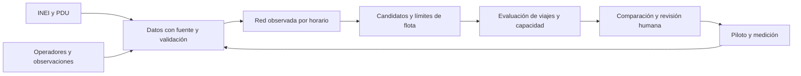

# Juliaca se mueve: plan de rutas, frecuencias y acceso a oportunidades

Versión 2, 18 de septiembre de 2026. Actualiza la propuesta inicial con el diagnóstico PDU Juliaca 2026-2035. Es un plan de trabajo sustentado en revisión documental; no afirma que el optimizador esté implementado ni que sus beneficios ya hayan sido medidos.

**Implementación posterior en el proyecto:** ya existe el [Laboratorio de movilidad](LABORATORIO_MOVILIDAD.md), con catálogo PDU, censo, destinos/calendario, comparación de acceso y recursos, alternativas de frecuencia/desvío, observaciones y persistencia. La guía distingue lo implementado de las fases que requieren demanda OD, red validada, optimización conjunta y trabajo de campo. Las estimaciones y metas de este plan conservan su carácter de propuesta.

Lectura complementaria: [auditoría de fuentes, tablas y discrepancias](AUDITORIA_PDU_MOVILIDAD.md). Ese documento contiene páginas exactas del PDU, inventario de 40 registros de flota y límites de reutilización.

## 1. Propuesta que recomiendo presentar

**Una plataforma que ayuda a técnicos y transportistas a comparar cambios de recorridos, paraderos y frecuencias, considerando dónde vive la población, adónde viaja, qué vehículos pueden operar y cómo cambian las calles según el horario y el día.**

El producto debe responder cuatro preguntas concretas:

1. ¿Qué barrios tienen un acceso insuficiente a trabajo, educación, salud y comercio?
2. ¿Qué cambio pequeño en la red mejora esos viajes con la flota realmente disponible?
3. ¿Cómo cambia la propuesta un lunes de feria, en hora punta o cuando un tramo queda intransitable?
4. ¿Cuánto mejora, cuánto cuesta, a quién perjudica y qué evidencia respalda la decisión?

Mantener el Desafío 2 como categoría principal. El beneficio sobre planificación vial es complementario. La seguridad se aborda mediante accesos, cruces, capacidad de unidades y restricciones verificadas; no mediante promesas de predecir delitos.

Frase de presentación: «Juliaca se mueve transforma población, rutas y actividad urbana en alternativas de transporte que podemos comparar antes de llevarlas a la calle».

## 2. Qué cambia respecto de la primera propuesta

| Antes | Mejora con el PDU | Resultado concreto |
|---|---|---|
| Densidad y destinos todavía por identificar | Catálogo documental de líneas, flota, atractores, terminales y calles conflictivas | Un inventario inicial con fuentes y páginas |
| Una red genérica de micros | Composición de combis/microbuses por empresa, con cifras por conciliar | Restricciones de flota y capacidad específicas del piloto |
| Un único escenario de circulación | Horas de congestión y calendario de ferias/ocupación vial | Comparación por franja y tipo de día |
| Ruta dibujada sobre calles | Diferencias documentadas entre itinerario autorizado y recorrido observado | Historial de tres estados: documentado, observado y propuesto |
| Medir solo cercanía a una línea | Acceso completo a trabajo, salud, educación y comercio | Caminata, espera, transbordos, tarifa y llegada al destino |
| Propuesta de reorganizar toda la ciudad | Ensayo de mejoras sobre 2-3 líneas y un área acotada | Piloto viable, medible y reversible |

El anexo del PDU ya utiliza isócronas de acceso a equipamientos. Por tanto, la diferenciación no debe ser simplemente «tenemos un mapa de cobertura»: será **comparar decisiones operativas, explicar sus consecuencias y verificar los resultados con usuarios y operadores**.

## 3. Ámbito y piloto recomendado

El contexto metropolitano abarca Juliaca, San Miguel y Caracoto. Los archivos censales revisados cubren manzanas de Juliaca y San Miguel; no se debe atribuirles todo el agregado de viajes del PMUS. Mantener Caracoto y otras localidades como zonas externas en el primer modelo, hasta disponer de población y viajes compatibles.

### Piloto principal: acceso al centro y desvíos documentados

Área de estudio candidata: entorno de Jáuregui, Unión, San Román y Mariano Núñez, con las conexiones peatonales y viales que resulten pertinentes. La elección se apoya en las discrepancias entre itinerarios y operación descritas en las páginas 179-180 y la referencia histórica de intersecciones de la página 183.

Invitar a evaluar 2-3 líneas de las mencionadas entre las afectadas, por ejemplo Las Mercedes L-01, 1ro de Mayo L-04 o Sur Horizonte L-18. Son **candidatas para coordinación**, no líneas seleccionadas por un cálculo de demanda. El PDU reporta flotas de 35+5, 50+19 y 75+15 respectivamente; no asumir que todas sus unidades están disponibles para el piloto.

Entregable: comparar el recorrido observado con una mejora de frecuencia/paraderos y, solo si la red lo permite, una alternativa de trazado. Mantener continuidad hacia los destinos del centro y medir cualquier aumento de caminata.

### Pilotos alternativos

| Alternativa | Problema y evidencia | Cuándo elegirla |
|---|---|---|
| San José / Túpac Amaru y accesos del lunes | Actividad comercial, conexiones externas y ocupación semanal, pp. 49, 184, 192-193 | Si hay colaboración de operadores/comerciantes y posibilidad de medir un lunes y otro día comparable |
| Acceso desde sectores de San Miguel a servicios de salud/educación | Atractores de salud y brechas de accesibilidad, pp. 185 y 232-236 | Si el problema de cobertura y los cruces/barreras pueden documentarse mejor que en el centro |

Seleccionar con evidencia, sin inventar una puntuación: disponibilidad de rutas y operador; gravedad observada del problema; posibilidad de medir antes/después; viabilidad vial; beneficio a sectores mal atendidos. El piloto cambia si falla la disponibilidad de datos o colaboración, no por preferencia estética del mapa.

## 4. Datos: qué cargar, qué verificar y qué falta

### 4.1 Población por manzana

Conservar la base 2017 y su año. En Juliaca se verificaron 5.204 geometrías, 2.473 con población y 2.731 sin correspondencia poblacional; la suma asociada es 194.987. En San Miguel: 1.725, 728 y 997 respectivamente, con 51.924 habitantes asociados. No son totales censales certificados de los distritos ni población 2026.

Acciones: comprobar identificador completo y ceros iniciales; separar nulo de cero; revisar subdivisiones y fusiones; calcular superficie en CRS métrico adecuado; conciliar la cifra de la captura anterior (194.694) con la versión actual. Una zona sin dato debe aparecer como pendiente de investigación, no como sin demanda.

Para escenarios actuales, obtener totales y geometrías comparables del censo más reciente disponible. Cualquier redistribución por viviendas, huellas construidas o uso residencial debe etiquetarse como estimación, con sensibilidad. No multiplicar todas las manzanas por un único factor y llamar al resultado población censada actual.

### 4.2 Oferta de transporte

La tabla 95 permite iniciar un catálogo documental de 40 filas; la tabla 97 agrega longitudes por sentido. Conservar la discrepancia 1.963 declarados / 1.969 suma de filas, sin elegir silenciosamente un total.

Para cada línea del piloto obtener: empresa e identificadores/alias; resolución y vigencia si se dispone; trazado por sentido; cabeceras y lugares de regulación; abordajes; primera/última salida por día; intervalos observados; vehículos activos por turno; capacidad habilitada; descansos; tarifa y reglas de transbordo.

Separar **empresa, línea, variante, sentido, salida y vehículo**. Una empresa no siempre equivale a una geometría y una línea puede cambiar por sentido o calendario. No asignar el horario general 05:00-22:00 de la p. 178 a todas las líneas.

### 4.3 Destinos y actividad

Semilla de atractores, para georreferenciar entradas y revisar duplicaciones:

- Comercio: San José, Las Mercedes, Túpac Amaru, Santa Bárbara, Manco Cápac, Pedro Vilcapaza, Centro Comercial N.º 2, Real Plaza/Plaza Vea y entorno de Moquegua/San Martín.
- Servicios y espacios de encuentro: Plaza Mayor, Plaza Bolognesi, Plaza Zarumilla y Plaza San Miguel.
- Salud: Hospital Carlos Monge Medrano y EsSalud de La Capilla, verificando establecimiento, acceso y atención efectiva.
- Educación: padrón ESCALE por código modular/local, matrícula por turno y hora de ingreso/salida. El PDU proporciona agregados, no el ranking de los colegios más concurridos.
- Conexiones externas: terminales y paraderos interurbanos de tablas 102-103; sus flujos no proceden solo de residentes locales.

No sumar visitantes de Jr. San Martín + Real Plaza + Plaza Vea si corresponden al mismo viaje. Mantener jerarquía de complejo, establecimiento y entrada. Los aproximadamente 2.860 comerciantes de la plataforma San José o 1.560 de la plataforma Virgen de Las Mercedes reportados en p. 49 son indicadores de actividad laboral; **no son compradores/hora ni pasajeros de micro**.

Cada destino requiere calendario, afluencia por franja, personal, modo de llegada y punto de entrada. Sin afluencia medida, conservar un rango de atracción hipotética en lugar de una cifra aparentemente exacta.

### 4.4 Calles y eventos

Crear dos redes: peatonal y vehicular para micros. Registrar por segmento sentidos, giros, superficie, ancho útil, altura/peso cuando aplique, velocidad observada, cruces, rampas, barreras y calidad del dato. No considerar las vías proyectadas del PDU como existentes.

Calendario inicial documentado: ocupación permanente; lunes; sábado; domingo; festividades. El PDU identifica lugares y días, pero no siempre horas de inicio/fin ni límites precisos. No inventar un cierre de 24 horas. Registrar «afectación documentada, horario pendiente» y validar ventanas antes de usar restricciones automáticas.

Una ocupación parcial no implica cierre completo: puede reducir capacidad, dificultar abordaje o interrumpir la vereda. Una feria modifica tanto la demanda como la circulación. Deben cambiar ambas capas en el escenario correspondiente.

Para lluvia, usar mapas de peligro como criterio para seleccionar puntos a revisar y simular interrupciones plausibles. Un mapa de riesgo no es un sensor de calle anegada en tiempo real.

### 4.5 Datos solicitados a instituciones

Preparar solicitud, sin depender de recibir respuesta para la inscripción:

| Destinatario propuesto | Material concreto que se necesita |
|---|---|
| Municipalidad / IMP | Versión y fecha del PDU; tablas editables 95 y 97; geometrías de rutas, red vial, afectaciones, equipamientos y metadatos; aclaración de totales |
| Gerencia de Transporte | Padrón vigente, itinerarios por sentido, resoluciones, variantes, capacidad habilitada, paraderos y situación de Carril Bus |
| PROMOVILIDAD / equipo PMUS | Matriz OD agregada por zonas, motivo/franja/modo; zonas geográficas; factores de expansión; metodología; aforos de 18 ejes; velocidades/tiempos de 14 corredores y fechas |
| Operadores | GPS con permiso, despachos, flota activa, tiempos de ciclo, tarifas, costes por unidad y contingencias habituales |
| Colegios, mercados y salud | Entradas, horarios por turno/actividad y conteos agregados de usuarios y personal |

No pedir domicilios, nombres o trazas identificables cuando basten tablas agregadas. Evitar publicar ubicaciones de encuestados. Registrar licencia/permiso de reutilización y acceso a cada conjunto.

## 5. Calidad y modelo de información

Todo registro tendrá fuente, página/tabla o archivo, fecha de observación, fecha de publicación, territorio, unidad, método, estado de validación y responsable. La fecha de publicación del PDU no convierte todos sus insumos en mediciones de 2026.

Estados independientes:

- Evidencia: documental, observado en campo, estimado, supuesto de escenario.
- Validación: pendiente, revisado, en conflicto, descartado.
- Operación: borrador, en revisión, aprobado para el piloto, retirado.

Esquema propuesto:

| Entidad | Campos y relaciones esenciales |
|---|---|
| `sources`, `source_claims` | Versión, fuente, página, fecha, valor original y discrepancia |
| `census_blocks` | ID territorial, población/año, sexo agregado, área, geometría, calidad de correspondencia |
| `places`, `place_entrances`, `activity_profiles` | Tipo, complejo padre, entrada, matrícula/actividad, unidad y calendario |
| `operators`, `lines`, `route_variants` | Alias, fuente de autorización, sentido, geometría documentada/observada/propuesta |
| `fleet_profiles`, `service_windows`, `departures` | Tipo/capacidad, disponibilidad por operador, calendario, despachos y frecuencia |
| `boarding_points`, `transfer_links` | Lado/sentido, acceso a pie, infraestructura y condición verificada |
| `street_edges`, `street_restrictions` | Geometría, tránsito permitido, perfil vehicular, calendario y barreras |
| `observations`, `od_estimates` | Conteo o viaje agregado, franja, muestra, expansión e incertidumbre |
| `scenarios`, `scenario_results` | Red base, cambios, presupuesto/flota, versiones, métricas y advertencias |

Las tablas documentales con conflictos pueden visualizarse; no deben incorporarse automáticamente a una recomendación operativa. Guardar originales y derivados por separado. El PDF/imagen es evidencia, no base transaccional del algoritmo.

## 6. Método de cálculo por niveles de evidencia

### Nivel A: accesibilidad potencial, ejecutable antes de tener OD

Calcular habitantes conocidos con acceso a abordajes a través de calles caminables; tiempos hacia servicios con un escenario de frecuencias explícito; zonas sin cobertura y zonas sin datos. Mostrar acceso a servicios seleccionados con umbrales configurables y justificados, por ejemplo 30/45 minutos como escenarios de comparación.

Este nivel no pronostica cuántos pasajeros utilizarán una ruta. No llamar a su promedio «tiempo medio de todos los usuarios» si está ponderado solo por población y destinos elegidos. Mostrar también viajes no realizables y no excluirlos del denominador para mejorar artificialmente el resultado.

### Nivel B: demanda calibrada

Construir viajes origen-destino por franja, motivo y tipo de día. Usar encuestas, ascensos/descensos y conteos; datos PMUS solo cuando su ámbito, expansión y denominador estén aclarados. La nota de prensa sirve de contexto, no de matriz OD.

Si inicialmente se emplea un modelo de distribución por actividad y tiempo de acceso, documentar sus tasas/coeficientes y calibrarlos con observaciones. Conservar viajes de entrada/salida desde otras localidades y distinguir viaje de persona de abordaje: un viaje con transbordo produce dos abordajes.

Modelar calendarios escolar/comercial y flujos de retorno. Evitar confundir lugar de residencia con origen de todos los viajes del día. Evaluar demanda baja, central y alta sin presentar esos escenarios como intervalos estadísticos si no se han estimado de esa forma.

### Nivel C: optimización de recorridos y frecuencias

Generar candidatos a partir de rutas observadas: mantener recorrido y ajustar frecuencias, mover un punto de abordaje, pequeño desvío, extensión, conexión transversal o servicio corto de refuerzo. Explorar pocos candidatos operativamente interpretables antes de rediseñar toda la red.

Evaluar caminos sobre red vial dirigida y restricciones por tipo de vehículo. La ida y la vuelta se resuelven de manera independiente; no invertir una polilínea suponiendo doble sentido.

Seleccionar alternativas mediante optimización con restricciones de:

- Unidades activas disponibles por operador y tipo, mantenimiento/reserva, turnos y tiempo de ciclo.
- Capacidad por tramo, sentido y franja. La capacidad se comprueba en el tramo de máxima carga, no con pasajeros diarios divididos por flota total.
- Duración/longitud máxima, terminales capaces de recibir/regular unidades y calles compatibles.
- Cobertura mínima, espera máxima objetivo y protección de conexiones esenciales.
- Coste operativo y coste para el pasajero; no asumir integración tarifaria gratuita.
- Estabilidad del servicio: penalizar cambios extensos y frecuentes que vuelvan la red incomprensible.

Objetivos a comparar: tiempo completo, acceso a oportunidades, número de transbordos, coste/vehículo-km y equidad. Mostrar alternativas no dominadas y sus sacrificios. No afirmar «mejor ruta universal»: el resultado depende de objetivos, datos y candidatos disponibles.

Un solucionador puede probar un óptimo para el modelo formulado, o devolver una solución factible con límite de tiempo. Registrar cuál fue el caso y la brecha si se dispone. No confundirlo con optimalidad sobre todas las posibles redes de Juliaca.

### Nivel D: impacto sobre tráfico

Requiere conteos de otros modos, capacidades de intersecciones, colas, ciclos semafóricos y calibración por corredor. Usar SUMO posteriormente si ese análisis es necesario. Una ruta con menos tiempo calculado o menos superposición no demuestra por sí sola una reducción de congestión de la ciudad.

## 7. Flota, frecuencia y viabilidad económica

El tiempo de ciclo debe incluir ida, vuelta, detenciones, regulación y recuperación. Como chequeo inicial:

`unidades en circulación ≈ redondear hacia arriba(tiempo de ciclo / intervalo entre salidas)`

Añadir reservas y descansos que no estén ya incluidos, evitando contarlos dos veces. La operación detallada debe validarse con programación de vehículos y personal.

Ejemplo didáctico, no resultado local: un ciclo de 90 minutos con intervalo de 10 minutos necesita unas 9 unidades en circulación. Si el desvío eleva el ciclo a 110 minutos, mantener ese intervalo exige unas 11; con las mismas 9, el intervalo aumenta aproximadamente a 12,2 minutos. Por eso un recorrido que cubre más barrios puede empeorar la espera si no hay flota.

Oferta de plazas por hora/sentido: salidas/hora × capacidad habilitada, con objetivo de ocupación/comodidad configurable. No adoptar automáticamente las 23/38 personas del PDF como capacidad legal o deseable de toda unidad.

Medir irregularidad de intervalos. La espera media de medio intervalo es una aproximación con servicio regular y llegadas compatibles, no una regla universal para micros agrupados. Incorporar variabilidad y personas que no pueden abordar por falta de capacidad.

La ficha económica incluirá horas y kilómetros de servicio adicionales, combustible/mantenimiento, personal, tarifa efectiva y efecto de transbordos. Ingreso esperado requiere abordajes pagantes y descuentos: no multiplicar población cubierta por tarifa. Comparar con flota actual primero; adquisición de unidades es un escenario aparte.

## 8. Escenarios que la plataforma debe comparar

| Código | Escenario | Hipótesis que permite comprobar |
|---|---|---|
| S0 | Operación observada actual | Línea base y problemas medibles |
| S1 | Mismo recorrido, ajuste de despachos/frecuencia | Mejorar espera y regularidad sin alterar cobertura |
| S2 | Ajuste de abordajes y acceso peatonal | Reducir caminata problemática y detenciones conflictivas |
| S3 | Modificación limitada de recorrido con igual flota | Ganar acceso o reducir rodeos sin ocultar cambios de intervalo |
| S4 | Variante planificada para lunes/sábado/domingo | Mantener acceso a mercados considerando ocupación efectiva de calles |
| S5 | Interrupción de un tramo por lluvia/obra | Comparar contingencias y barrios que pierden acceso |
| S6 | Carril Bus propuesto | Evaluar un diseño confirmado, sin asumir que el anuncio acredita infraestructura operativa |

Implementar S0-S3 primero y una variante S4 para la demostración. S5-S6 quedan condicionados a datos. No cambiar rutas automáticamente cada pocos minutos; las variantes deben tener calendario, comunicación y revisión operativa.

## 9. Arquitectura e integración con la página existente

Mantener React/TypeScript y MapLibre para interfaz; FastAPI/Python para cálculo; PostGIS para geografía. Incorporar OR-Tools para selección de candidatos/frecuencias, y OpenTripPlanner para evaluar viajes sobre redes GTFS/OSM. La formulación del optimizador es trabajo propio; no se obtiene cargando un KML en OTP.

Flujo propuesto:

La documentación previa del proyecto describe OSRM de automóvil y simulación visual de micros/semáforos. Verificar su estado antes de integrar: un perfil de automóvil no acredita transitabilidad del micro y una animación no es microsimulación de tráfico.

Procesos pesados como trabajos en segundo plano: API crea tarea, devuelve identificador, informa progreso, permite cancelar y guarda resultado reproducible. La interfaz no debe quedar bloqueada durante construcción de red o búsqueda de candidatos. Fijar versiones compatibles del motor y validar integración con un caso conocido.

Separar catálogo de evidencia y escenarios de la información pública para viajar. Guardar red base inmutable por versión, historial de cambios y posibilidad de retirar un piloto. Guardar filtros/mapa localmente puede ayudar con conectividad, pero la coordinación entre dispositivos necesita backend desplegado.

Si se utiliza un asistente de lenguaje, limitarlo a explicar resultados y ayudar a registrar observaciones con confirmación. No permitir que invente coordenadas, afluencias ni restricciones, ni que publique rutas por sí solo.

## 10. Módulos de interfaz y criterios de aceptación

| Prioridad | Módulo | Qué debe hacer | Se considera listo cuando... |
|---|---|---|---|
| P0 | Fuentes y calidad | Mostrar procedencia, versión, nulos y conflictos | Un usuario puede rastrear cada cifra a su fuente y ver las dos cifras de flota en conflicto |
| P0 | Catálogo documental | Empresas/líneas, destinos y eventos del PDU | Se puede filtrar por tipo, página y validación sin presentarlos como datos operativos vigentes |
| P0 | Rutas observadas | Importar/dibujar ambos sentidos, abordajes, operación y alias | Las líneas del piloto tienen trazado y servicio revisados o muestran claramente lo pendiente |
| P1 | Cobertura y oportunidades | Acceso por red peatonal y tiempos completos | No cuenta habitantes dos veces, no cruza barreras sin conexión y distingue población desconocida |
| P1 | Comparador | S0, S1, S2 y S3 con igual base de evaluación | Expone tiempos, acceso, flota, coste y sectores que empeoran, incluidos viajes no atendidos |
| P1 | Calendario | Afectaciones de feria con tramo y ventana temporal | Una restricción confirmada modifica solo su segmento y horario; una pendiente no se hace pasar por cierre verificado |
| P2 | Generador de alternativas | Candidatos explicables y restricciones operativas | Descarta imposibles y declara si no encuentra una mejora factible |
| P2 | Seguimiento del piloto | Observaciones antes/después y registro de cambios | Resultados reproducibles con fecha, muestra, versión y límites |

Pantalla de comparación: seleccionar día/franja; ver escenario base; establecer flota y objetivos; ejecutar; comparar alternativas en mapa; revisar ficha de ganadores/perdedores; exportar para revisión. No llenar el flujo del usuario de nombres de bibliotecas o parámetros que no necesita decidir.

## 11. Plan de campo y validación

Asignar tres responsabilidades: datos/cartografía; operación y coordinación; software/evaluación. Pueden repartirse entre tres integrantes, pero todos deben comprender la propuesta. Se necesita revisión de un profesional de transporte para decisiones operativas complejas; no dar por confirmada su participación.

Campaña inicial propuesta: dos días hábiles ordinarios y un día comercial relevante, en ventanas de mañana, mediodía y tarde. Observar periodos anteriores y posteriores a las 07:00, no solo una foto de esa hora. Ajustar las ventanas después del reconocimiento. Es una muestra exploratoria; ampliarla si hay variabilidad y no extrapolarla como muestra representativa de toda Juliaca.

Registrar en ambos sentidos: hora de paso de cada unidad, tipo/capacidad, ascensos/descensos, ocupación por tramo, demoras y causa, tiempos de viaje y espera. Añadir conteos por modo en intersecciones críticas; actividad y acceso a destinos; encuestas cortas de origen/destino agregado, motivo, coste y transbordos. No incluir nombres, DNI ni domicilio exacto.

Reservar días o viajes independientes para validar, sin calibrar y evaluar con los mismos registros. GPS requiere consentimiento/acceso autorizado y control de calidad. Con lluvia, obras o eventos distintos, indicar el cambio y evitar atribuir toda diferencia al piloto.

Pruebas de cálculo necesarias durante el desarrollo:

- Manzanas repetidas, población nula y cambios de límites no inflan cobertura.
- Un puente ausente, calle peatonal o sentido contrario impide el recorrido correspondiente.
- Calendarios y excepciones cambian la red en el momento correcto.
- Una vuelta más larga aumenta flota necesaria o intervalo, sin crear vehículos ficticios.
- La capacidad por tramo detecta sobrecarga y pasajeros no atendidos.
- Transbordos incorporan espera, caminata y coste; no inventan gratuidad.
- Un destino duplicado o varias entradas del mismo complejo no multiplican viajes.
- Se reportan alternativas inviables, incertidumbre y viajes desconectados.

## 12. Indicadores y decisión de continuar

| Indicador | Cómo se calcula | Límite de interpretación |
|---|---|---|
| Acceso a abordajes | Habitantes conocidos únicos dentro de acceso peatonal configurable; sensibilidad a 300/400/500 m | No equivale a demanda; informar manzanas/población sin dato |
| Acceso a oportunidades | Población que alcanza servicios seleccionados en umbral temporal y horario de atención | Una plaza escolar o consulta debe estar disponible; cercanía no garantiza atención |
| Tiempo completo | Caminata, espera, vehículo, transbordos y salida; mediana/P90 y ponderación explícita | Solo llamarlo tiempo de usuarios cuando exista demanda representada adecuadamente |
| Regularidad | Distribución de intervalos, agrupamiento y esperas observadas | No sustituir por frecuencia nominal |
| Carga | Pasajeros por tramo/sentido/hora frente a capacidad ofertada | Promedios diarios ocultan sobrecargas |
| Recursos | Unidades activas, reserva, horas-vehículo, vehículo-km y coste | Padrón afiliado no es flota disponible |
| Equidad | Resultados por barrio y perfil de movilidad, viajes perdidos y cambios de tarifa | No inferir necesidades individuales del sexo censal |
| Tráfico y sostenibilidad | Demora/colas observadas; consumo o emisiones solo con metodología y datos de flota | No convertir automáticamente kilómetros ahorrados en CO2 medido |

Antes del ensayo acordar una meta principal, por ejemplo **reducir al menos 10% el tiempo completo en los viajes evaluados con igual flota activa**, como objetivo propuesto y no resultado garantizado. Acompañarla de límites: ninguna conexión esencial perdida sin alternativa; capacidad respetada; coste y tarifa aceptables; degradaciones por barrio visibles y justificadas. Si no puede demostrarse esa reducción, reportar lo obtenido y decidir otra intervención.

No exigir simultáneamente todos los máximos de cobertura, velocidad y ahorro: pueden competir. El comparador debe hacer visible ese compromiso. En análisis potencial sin OD, elegir una meta de accesibilidad en lugar de una reducción del tiempo medio de pasajeros.

## 13. Cronograma realista y esfuerzo

### Concurso, según las fechas de las bases aportadas

| Ventana | Trabajo | Entrega verificable |
|---|---|---|
| 18-19 de septiembre | Cerrar problema, evidencias y alcance; elegir piloto candidato; preparar fuentes y pendientes | Propuesta coherente y tabla de datos, sin promesas de operación ya lograda |
| Antes del 20 de septiembre, 23:59 | Completar propuesta, anexos y revisión de requisitos; envío por el equipo | Inscripción dentro de plazo, sin esperar el informe PMUS |
| 21-24 de septiembre | Si el equipo resulta habilitado: preparar/ajustar demostración, verificar un caso y ensayar | Mapa base + alternativa + ficha operativa, con toda hipótesis etiquetada |
| 25 de septiembre | Presentación de cinco minutos y preguntas | Explicación de problema, evidencia, solución, piloto e impacto medible |

Las bases permiten una idea sin prototipo completo. En los días disponibles priorizar evidencia y una comparación transparente. No es realista prometer un modelo calibrado de toda la ciudad antes del cierre. Confirmar cualquier cambio de cronograma en los canales del organizador.

### Desarrollo y piloto después de la ideatón

| Fase | Duración orientativa | Dependencia y entrega |
|---|---|---|
| 0. Acuerdo de alcance | 2-3 días | Operador/área elegidos, responsabilidades y acceso a datos |
| 1. Inventario y conciliación | Semana 1 | Catálogo PDU, geometrías candidatas, reglas de calidad y solicitud de datos |
| 2. Reconocimiento y campo | Semanas 1-2 | Recorridos/servicio observados y primera línea base |
| 3. Accesibilidad y comparador | Semanas 2-3 | S0-S2, población conocida, costes y viajes no atendidos |
| 4. Candidatos y calibración | Semanas 3-5 | S3-S4, límites de flota, demanda y validación independiente |
| 5. Revisión y ensayo | Semanas 5-7, condicionado a aprobación operativa | Piloto acotado, aviso a usuarios y mecanismo de reversión |
| 6. Evaluación | Semana 8 | Informe antes/después, límites, costes y decisión de ampliar |

Estimación de esfuerzo inicial para presupuestar: datos/GIS 40-60 h; coordinación/campo 48-72 h-persona; backend/modelo 64-96 h; interfaz/comparación 32-48 h; QA/documentación/pitch 24-40 h. Total orientativo **208-316 h-persona**, sujeto a estado del código, datos y colaboración. No incluye digitalizar/calibrar toda la ciudad ni implantar infraestructura física. Las horas de campo son agregadas: una jornada de tres personas cuenta tres veces su duración.

Ruta crítica: rutas/servicios observados → red vial revisada → línea base → comparación → revisión → ensayo. La recepción de datos PMUS puede acelerar/calibrar, pero no bloquea el nivel A de accesibilidad potencial.

## 14. Presupuesto y sostenibilidad del proyecto

Separar desembolso de valor del trabajo del equipo. No describir el proyecto como gratuito porque las herramientas sean de código abierto.

Presupuesto a completar con cotizaciones y tarifas acordadas:

`total = horas por rol × tarifa por hora + jornadas y movilidad + infraestructura + revisión técnica + contingencia`

Ejemplo de planificación, **no cotización ni precio de mercado**: 240 h-persona × S/30 = S/7.200 de trabajo; S/900 de movilidad/datos/materiales; S/300 de infraestructura del piloto; S/800 de revisión técnica. Subtotal S/9.200; reserva ilustrativa de 15% S/1.380; total S/10.580. Si el trabajo es aportado por el equipo, sigue figurando como aporte valorizado; el desembolso y la reserva se recalculan sobre los compromisos reales. Sustituir todos estos supuestos antes de presentar un presupuesto cerrado.

Costes recurrentes: alojamiento de API/base/motores, copias, mantenimiento de datos, observaciones, soporte y coordinación. Medir carga y tamaño del grafo antes de dimensionar infraestructura. El despliegue del frontend no acredita que la API y los motores estén disponibles.

Adopción propuesta: administración técnica municipal o convenio de mantenimiento; operadores actualizan servicio y disponibilidad; equipo mantiene software y calidad; usuarios aportan reportes revisados. Son roles propuestos, no convenios logrados. Entregar exportaciones abiertas y documentación para reducir dependencia del equipo original.

## 15. Cómo demostrar valor ante el jurado

| Criterio, 20% cada uno | Evidencia concreta preparada por el plan |
|---|---|
| Innovación | Comparación explicable que integra flota heterogénea, rutas observadas, ferias y acceso a oportunidades; posicionarla como aplicación local verificable, no invención mundial del algoritmo |
| Impacto | Caso antes/después con población conocida, tiempos, coste, cobertura y perjudicados; metas y método de medición definidos |
| Viabilidad | Piloto acotado, datos existentes y faltantes, presupuesto, calendario, responsables y dependencia de validación operativa |
| Claridad | Una pregunta central: qué cambio mejora los viajes con recursos disponibles; una demostración que responde esa pregunta |
| Equipo/exposición | Roles definidos, tres integrantes con dominio transversal, guion cronometrado y respuestas sustentadas en fuentes |

Guion de cinco minutos: problema local y caso 40 s; evidencia y alcance 45 s; comparación en mapa 85 s; resultados disponibles/metas 60 s; operación, coste y piloto 45 s; cierre 25 s. Distinguir expresamente resultados calculados, medidos y pendientes. No llenar la presentación con todas las inconsistencias: mostrar que existe control de calidad y tener el detalle como respaldo.

Preguntas para ensayar: «¿Cómo saben cuántos pasajeros habrá?»; «¿Por qué una ruta y no otra?»; «¿Qué pasa el lunes?»; «¿Cuántas unidades hacen falta?»; «¿Quién autoriza y mantiene esto?»; «¿Qué barrio empeora?»; «¿Qué ocurre si no llega la base PMUS?»; «¿Qué parte ya funciona?». La respuesta debe apoyarse en evidencia, supuestos etiquetados o trabajo pendiente, según corresponda.

## 16. Riesgos y decisiones de control

| Riesgo real del proyecto | Respuesta prevista |
|---|---|
| Cifras documentales inconsistentes | Conservar valores originales y calculados; solicitar padrón vigente; no forzar conciliación |
| Manzanas sin población | Mostrar cobertura de datos; escenarios separados; priorizar levantamiento |
| Atractores sin afluencia | Usar catálogo para campo, no inventar pasajeros; medir horarios/entradas |
| Geometría de mapa imprecisa | Priorizar archivo vectorial; verificar ambos sentidos y errores topológicos |
| Falta de operador colaborador | Cambiar piloto o mantener resultado como análisis potencial, sin prometer ensayo operativo |
| Mejora del centro a costa de periferia | Revisar resultados por zona y asegurar conexiones esenciales |
| Más transbordos o coste al pasajero | Incluir tarifa/espera y comparar opción directa |
| Demanda o velocidad mal estimadas | Validación independiente y sensibilidad, sin ocultar viajes no atendidos |
| Cambios por feria/lluvia | Variantes revisadas y avisos; confirmar restricciones actuales |
| Falta de datos para emisiones/tráfico | Mantener indicadores operativos y posponer afirmaciones que no se puedan sostener |

## 17. Decisiones finales y próximos entregables

Construir primero **catálogo con evidencia + red observada del piloto + comparador de accesibilidad y recursos**. Después incorporar generación de alternativas y demanda calibrada. La propuesta ganará solidez al demostrar una mejora pequeña con evidencia, incluso si el alcance final es menor que toda la ciudad.

Orden de entregables: (1) catálogo PDU y lista de discrepancias; (2) geometrías/servicio del piloto; (3) destinos y calendario; (4) línea base; (5) tres alternativas y límites de flota; (6) revisión con actores; (7) ensayo y evaluación.

Estado al finalizar este análisis: revisión documental y plan detallado completados; datos de campo, geometrías operativas, optimizador, despliegue y ensayo aún pendientes. No se modificó el servicio público, no se enviaron solicitudes ni se realizó la inscripción.

## Referencias técnicas y documentales

- PDU local y fuentes web: páginas y límites detallados en [Auditoría PDU](AUDITORIA_PDU_MOVILIDAD.md).
- Bases locales: `C:/Users/ivang/Downloads/BASES_IDEATÓN POR EL TRANSPORTE URBANO_ JULIACA.pdf`, secciones III-VI y IX.
- [OR-Tools: optimización entera](https://developers.google.com/optimization/mip).
- [OpenTripPlanner: planificación multimodal con GTFS/OSM](https://www.opentripplanner.org/).
- [GTFS: especificación de horarios y frecuencias](https://gtfs.org/documentation/schedule/reference/).
- [SUMO: documentación de simulación](https://sumo.dlr.de/docs/).
- [MINEDU: descarga de información espacial](https://sigmed.minedu.gob.pe/descargas/).
- [ESCALE: Censo Escolar](https://escale.minedu.gob.pe/censo-escolar).
- [SUSALUD: RENIPRESS](https://www.gob.pe/institucion/susalud/campa%C3%B1as/95866-consulta-el-renipress).
